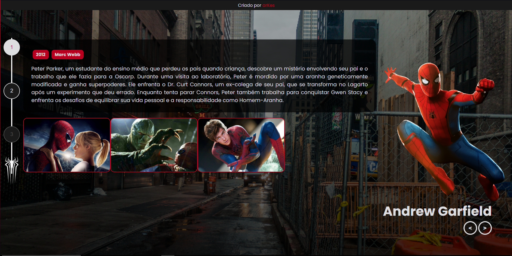

# Multiverso Spider-Man

<H2>Sobre</H2>

Esse projeto interativo, apresenta informações sobre cada filme, de cada ator do Homem-Aranha, com foco em um design visual atrativo e animações imersivas. Foi desenvolvido durante o Bootcamp da <a href="https://web.dio.me/track/coding-future-front-end-do-zero">DIO</a>

<h2><a href="0arkes.github.io/Multiverso-Spider-Man/">📸Clique aqui para visitar o projeto</a></h2>

    <h2>🕸️ Funcionalidades</h2>
    <ul>
        <li><strong>Carrossel de Personagens:</strong> Navegue entre diferentes versões do Homem-Aranha.</li>
        <li><strong>Conteúdo Dinâmico:</strong> Atualiza sinopse, imagens e detalhes do filme automaticamente.</li>
        <li><strong>Botões de Filme:</strong> Selecione e destaque filmes de cada ator.</li>
        <li><strong>Animações:</strong> Animações ao navegar entre os personagens.</li>
    </ul>

<h2>🛠️ Tecnologias Utilizadas</h2>

    
    
    
    
    

    <h2>Como Utilizar 💻</h2>
    <dl>
        <dt><h3>1. Navegar Entre os Personagens 🚶‍♂️</h3></dt>
        <dd><h4>Use "<" e ">" para mudar entre os personagens do Homem-Aranha.</h4></dd>
        <dt><h3>2. Selecionar Filmes 🎥</h3></dt>
        <dd><h4>Clique nos botões (1, 2, 3) para escolher um filme e ver suas informações.</h4></dd>
        <dt><h3>3. Personalização Visual 🎨</h3></dt>
        <dd><h4>O fundo e a imagem do Homem-Aranha mudam com base na seleção.</h4></dd>
    </dl>

<section>
    <h2>Como Rodar o Projeto</h2>
    
Siga os passos abaixo para rodar o projeto localmente:

    <ol>
        <li><strong>Baixe ou clone o repositório:</strong> 
            
Clone o repositório utilizando o comando:

            <code>git clone <a href="https://github.com/0arKes/Multiverso-Spider-Man.git">https://github.com/0arKes/Multiverso-Spider-Man.git</a></code>
        </li>
        <li><strong>Abra o arquivo HTML</strong> 
            
Abra o arquivo <code>index.html</code> em seu navegador | ou abra utilizando Line Server.

        </li>
        <li><strong>Pronto!</strong> 
            
O projeto estará rodando no seu navegador.

        </li>
    </ol>
</section>
